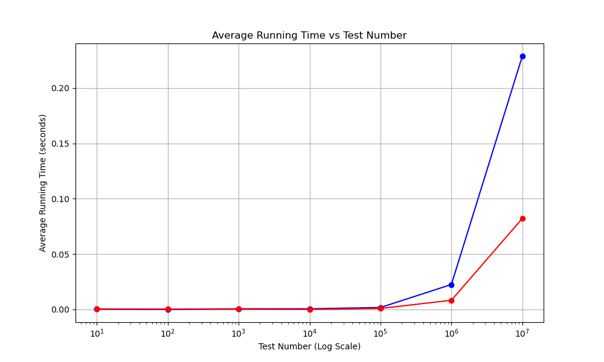
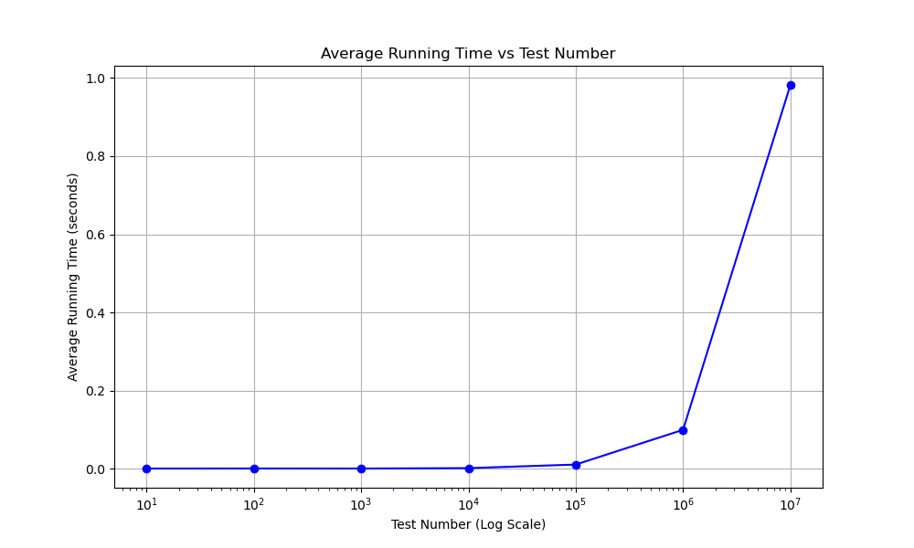
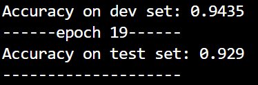
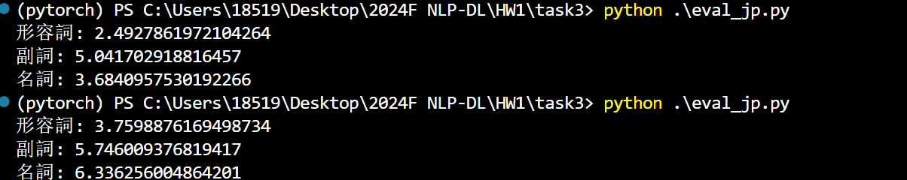

# hw 1 task 1 report

陈昕宇 2200017735

## 1.task1中大规模数据下的算法时间复杂度

实现的算法是最基础的for循环统计，如下

```python
def flatten_list(nested_list: list):
    output_list = []
    for list in nested_list:
        output_list.extend(list)
    return output_list


def char_count(s: str):
    char_count_dict = {}
    for char in s:
        if char in char_count_dict:
            char_count_dict[char] += 1
        else:
            char_count_dict[char] = 1
    return char_count_dict

```

设计了从10到10^7指数级增长的随机测试数据

​	对于第一个算法 设计了两组数据，第一组中每个list由长度固定为5的list构成，第二组中list由长度固定为数据量/10的list构成

统计了从10到10^7规模的数据下，两个基础算法的时间复杂度


| 测试名称   | 平均运行时间（秒）     |
| ---------- | ---------------------- |
| test_1_1e1 | 0.0003596305847167969  |
| test_1_1e2 | 0.0                    |
| test_1_1e3 | 0.000652313232421875   |
| test_1_1e4 | 0.0006623268127441406  |
| test_1_1e5 | 0.0018207073211669923  |
| test_1_1e6 | 0.022583484649658203   |
| test_1_1e7 | 0.22885477542877197    |
| test_2_1e1 | 0.0004015684127807617  |
| test_2_1e2 | 0.000355219841003418   |
| test_2_1e3 | 0.00033020973205566406 |
| test_2_1e4 | 0.00015707015991210936 |
| test_2_1e5 | 0.0009403228759765625  |
| test_2_1e6 | 0.008353710174560547   |
| test_2_1e7 | 0.08222310543060303    |



其中蓝线是第一组数据，红线是第二组数据。结果证明在10^6以上的时间复杂度上两个算法近似表现出了。同时外层list长度相比内层，对时间复杂度的贡献更大


对于第二个算法，设计了同等规模的数据量，测试结果如下



结果显示在1e4附近开始表现出随数据量的线性时间消耗

## task 2

CNN设置

```python
class ConvNetForText(nn.Module):
    def __init__(self, embedding_dim, window_size, num_filters, k):

        super(ConvNetForText, self).__init__()
        
        self.conv = nn.Conv1d(in_channels=embedding_dim, out_channels=num_filters, kernel_size=window_size)

        self.fc = nn.Linear(num_filters, k)
    
    def forward(self, x):

        x = x.permute(0, 2, 1)  
        

        x = self.conv(x)  
        x = F.relu(x)  

        x = F.max_pool1d(x, kernel_size=x.size(2))  
        x = x.squeeze(2)  

        x = self.fc(x)  
        return x

model  = ConvNetForText(embedding_dim, 3, 64, 4)
```

第20个epoch达到最佳性能



jp的word embedding使用https://github.com/tmu-nlp/JapaneseWordSimilarityDataset.git进行评测，结果如下



评测的loss定义为：两个相似词的cosine similarity映射到0~10范围内后减去人工标注similarity之后取平方

第一栏是训练得到的word embedding结果 第二栏是随机初始化的word embedding结果。由图可见，训练缩小了和人工标注的表征差距

en的word embedding使用**WordSim353** 进行评测，以同样的方式测得loss如下

训练前：5.821657900319055

训练后：5.3098007158634974

由图可见，训练缩小了和人工标注的表征差距

## task3

**Word2VecCBOW 词嵌入**：

- **CBOW（连续词袋模型）**：使用了两个预训练的词嵌入模型，分别用于英语（`cbow_model_en`）和日语（`cbow_model_jp`）。这些模型将词汇转换为向量表示，这些向量会输入到LSTM模型中。

**编码器（Encoder）**：

- **嵌入层（Embedding Layer）**：编码器使用了预训练的日语CBOW嵌入层，将源语言（即日语）句子中的单词转换为128维度的稠密向量（`ENC_EMB_DIM=128`）。
- **LSTM层**：编码器使用一个双向LSTM来处理输入句子。LSTM有两层（`N_LAYERS=2`），每层的隐藏状态维度为512（`HID_DIM=512`）。LSTM会处理源句子并生成一系列隐藏状态和细胞状态（hidden state 和 cell state）。
- **Dropout**：Dropout用于防止过拟合，编码器的Dropout率设置为0.5（`ENC_DROPOUT=0.5`）。

**注意力机制（Attention）**：

- 通过将解码器当前的隐藏状态和编码器的输出结合起来，计算出注意力权重。注意力机制通过一个线性层和`softmax`函数来生成注意力分布。

**解码器（Decoder）**：

- **嵌入层**：解码器使用了预训练的英语CBOW嵌入层，将目标语言（英语）中的词转换为向量。
- **LSTM层**：解码器使用双向LSTM，接收当前的目标词嵌入和来自编码器的注意力加权的上下文向量。它的结构和Encoder相同。
- **输出层**：解码器会将LSTM的输出、上下文向量和目标词嵌入进行拼接，然后通过一个全连接层（`fc_out`）预测下一个单词的概率分布。

**Seq2Seq 模型**：

- **Seq2Seq**模块整合了编码器和解码器。训练时，模型使用了“教师强制”（teacher forcing），即部分步骤使用真实的目标单词作为输入，而不是模型自己的预测。

模型训练了10个epoch保存得到

得到Bleu Score和perplexity如下：

|            | train set | valid set | test set |
| ---------- | --------- | --------- | -------- |
| perplexity | 0.4447    | 0.5076    | 0.5127   |
| BLEU score | 0.0469    | 0.0488    | 0.0483   |

并在5条cases下获得了输出如下：

case_1 = "私の名前は愛です"
case_2 = "昨日はお肉を食べません"
case_3 = "いただきますよう"
case_4 = "秋は好きです"
case_5 = "おはようございます"

['My', 'name', 'is', 'boring', '<EOS>']
['I', 'dont', 'eat', 'meat', 'yesterday', '<EOS>']
['Lets', 'think', 'you', '<EOS>']
['I', 'like', 'strawberries', '<EOS>']
['Good', 'morning', '<EOS>']

从中可以看出：

​	1.由于模型结构比较简单，训练数据量不足和没有精细地调整超参数的原因，模型的BLEU score不太好看，但再大体趋势上是符合预期的：valid set和test set的score低于train set

​	2.在5条case上的结果显示出模型有基础的翻译能力（比如2和5翻译的都还行）。但是由于1.部分词汇（如爱）在训练数据集中并没有出现 2.case3全是片假名，和日语的基本用法有所偏差，导致模型预测效果不佳

